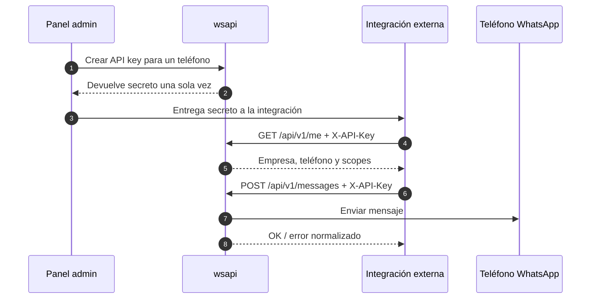

# S-8.7: Proceso de conexión API externa

## Objetivo

Documentar cómo una integración externa se conecta al API de `wsapi` usando una API key vinculada a un teléfono WhatsApp.

## Flujo resumido

1. El administrador entra al panel y abre la empresa.
2. Navega a `Teléfonos` y luego a `API keys` del teléfono.
3. Crea una API key nueva y copia el secreto una sola vez.
4. La integración externa prueba acceso con `GET /api/v1/me`.
5. A partir de ahí consume `/api/v1/messages` y `/api/v1/broadcasts` con `X-API-Key`.

## Diagrama



## Prerrequisitos

- La empresa debe existir y estar activa.
- El teléfono debe existir y estar activo.
- La API key debe estar activa y no expirada.
- El secreto solo se muestra al crear o rotar la key.

## Autenticación

La integración externa usa uno de estos encabezados:

| Encabezado | Ejemplo |
|---|---|
| `X-API-Key` | `X-API-Key: ak_live_...` |
| `Authorization` | `Authorization: ApiKey ak_live_...` |
| `Authorization` | `Authorization: Bearer ak_live_...` |

Reglas del middleware:

- Verifica el prefijo de la key.
- Busca la key activa en base de datos.
- Comprueba que la key pertenezca al teléfono y a la empresa esperados.
- Exige empresa activa y teléfono asociado existente.
- Registra uso y auditoría automáticamente.

## Endpoints públicos para integraciones

- `GET /api/v1/me`
- `GET /api/v1/messages`
- `POST /api/v1/messages`
- `GET /api/v1/broadcasts`
- `POST /api/v1/broadcasts`

## Scopes

Las API keys guardan `scopes` como metadata y también se exponen en el contexto de request.

Hoy la autorización efectiva se basa en:

- la empresa asociada a la key
- el teléfono asociado a la key
- el estado activo de empresa y teléfono

No hay enforcement fino por scope en los handlers v1 todavía; los scopes sirven para auditoría y para preparar un control más granular más adelante.

## Comportamiento por teléfono

Cuando la petición llega con API key:

- `telefono_id` puede omitirse en `POST /api/v1/messages` y `POST /api/v1/broadcasts`.
- Si se envía, debe coincidir con el teléfono de la API key.
- `GET /api/v1/messages` y `GET /api/v1/broadcasts` filtran automáticamente por el teléfono de la key si no se pasa `telefono_id`.

## Ejemplos

### Verificar conexión

```bash
curl -H "X-API-Key: ak_live_xxx" \
  http://localhost:8080/api/v1/me
```

### Enviar mensaje

```bash
curl -X POST http://localhost:8080/api/v1/messages \
  -H "X-API-Key: ak_live_xxx" \
  -H "Content-Type: application/json" \
  -d '{
    "destino": "51999999999",
    "contenido": "Hola desde la API"
  }'
```

### Respuesta de envío

```json
{
  "ok": true,
  "data": {
    "status": "sent"
  },
  "meta": {
    "empresa_id": 3,
    "timestamp": "2026-04-17T18:00:00Z"
  }
}
```

Notas:

- Con API key, `telefono_id` puede omitirse porque lo resuelve la key.
- Si se envía `telefono_id`, debe coincidir con el teléfono asignado a la key.
- Con JWT de empresa, `telefono_id` sigue siendo obligatorio en el contrato v1.

### Crear difusión

```bash
curl -X POST http://localhost:8080/api/v1/broadcasts \
  -H "X-API-Key: ak_live_xxx" \
  -H "Content-Type: application/json" \
  -d '{
    "destinos": ["51999999999", "51988888888"],
    "mensaje": "Hola equipo"
  }'
```

## Respuesta esperada de `GET /api/v1/me`

```json
{
  "ok": true,
  "api_key": {
    "id": 12,
    "empresa_id": 3,
    "telefono_id": 8,
    "key_prefix": "ak_live_9f2c",
    "scopes": ["messages:read", "messages:write"]
  },
  "empresa": {
    "id": 3,
    "nombre": "Empresa Demo S.A.C."
  },
  "telefono": {
    "id": 8,
    "numero_completo": "51999999999"
  }
}
```

## Ciclo de vida de la key

- **Crear**: genera una key activa y devuelve el secreto una sola vez.
- **Rotar**: crea una nueva key y revoca la anterior en la misma operación.
- **Revocar**: deja la key inutilizable de inmediato.
- **Auditar**: cada request deja un registro de uso y métricas diarias.

Si necesitas el detalle del envío de mensajes, revisa `spec-8-8-envio-mensajes-api.md`.

## Errores comunes

| Código | Caso |
|---|---|
| `API_KEY_REQUIRED` | Falta la API key |
| `INVALID_API_KEY` | La key es inválida, revocada o expirada |
| `TELEFONO_NOT_FOUND` | El teléfono de la key no existe |
| `EMPRESA_NOT_FOUND` | La empresa asociada no existe |
| `EMPRESA_INACTIVE` | La empresa está inactiva |
| `FORBIDDEN` | La key no corresponde al teléfono solicitado |

## Operación recomendada

1. Crear la key desde el panel admin.
2. Guardar el secreto en un vault o variable segura.
3. Probar `GET /api/v1/me`.
4. Enviar un mensaje de prueba.
5. Habilitar métricas y auditoría antes de mover tráfico real.

Documento actualizado: 2026-04-17
