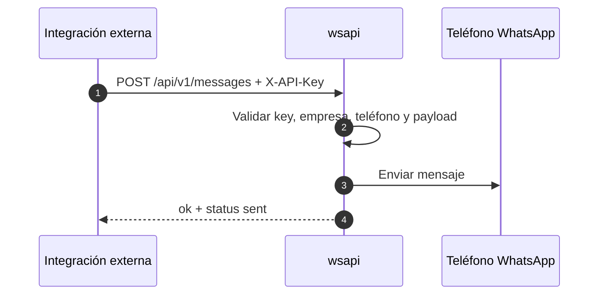

# S-8.8: Envío de mensajes vía API

## Objetivo

Documentar el contrato real para enviar mensajes directos desde integraciones externas usando `wsapi`.

## Alcance

Esta guía cubre:

- `POST /api/v1/messages` para enviar un mensaje.
- `GET /api/v1/messages` para consultar historial y auditoría.
- El comportamiento cuando la petición viene con API key o con JWT de empresa.

## Flujo resumido

1. La integración obtiene una API key válida.
2. Verifica conexión con `GET /api/v1/me`.
3. Envía un mensaje con `POST /api/v1/messages`.
4. Consulta historial con `GET /api/v1/messages` si necesita auditoría.

## Diagrama



## Endpoint principal

### `POST /api/v1/messages`

Envía un mensaje directo asociado a una empresa y un teléfono WhatsApp.

#### Headers

| Encabezado | Requerido | Ejemplo |
|---|---|---|
| `X-API-Key` | sí para integraciones externas | `X-API-Key: ak_live_xxx` |
| `Authorization` | alternativa | `Authorization: ApiKey ak_live_xxx` |

#### Request

```json
{
  "destino": "51999999999",
  "contenido": "Hola desde la API"
}
```

`telefono_id` se maneja así:

- Con API key, puede omitirse porque lo resuelve la key.
- Si se envía, debe coincidir con el teléfono asignado a la key.
- Con JWT de empresa, `telefono_id` es obligatorio.

#### Reglas

- `destino` y `contenido` son obligatorios.
- El teléfono debe pertenecer a la misma empresa que la key o el JWT.
- El teléfono debe estar activo.
- El mensaje se persiste antes de responder.

#### Respuesta 200

```json
{
  "ok": true,
  "data": {
    "status": "sent"
  },
  "meta": {
    "empresa_id": 3,
    "timestamp": "2026-04-17T18:00:00Z"
  }
}
```

#### Nota operativa

La respuesta inmediata marca `status: sent`, pero el registro interno queda como `pending` mientras el flujo WhatsApp continúa.

## Historial

### `GET /api/v1/messages`

Retorna mensajes de la empresa autenticada.

#### Filtros

| Query param | Comportamiento |
|---|---|
| `telefono_id` | Filtra mensajes de un teléfono específico |
| `limit` | Límite de resultados |

Con API key, si no se pasa `telefono_id`, el endpoint filtra automáticamente por el teléfono de la key.

#### Respuesta

```json
{
  "ok": true,
  "data": {
    "messages": [],
    "total": 0
  },
  "meta": {
    "empresa_id": 3,
    "timestamp": "2026-04-17T18:00:00Z"
  }
}
```

## Errores comunes

| Código | Caso |
|---|---|
| `TOKEN_REQUIRED` | No hay JWT ni API key |
| `INVALID_JSON` | El body no es JSON válido |
| `MISSING_FIELDS` | Falta `destino`, `contenido` o `telefono_id` |
| `FORBIDDEN` | El teléfono no corresponde a la empresa/key |
| `TELEFONO_NOT_FOUND` | El teléfono no existe |
| `SESSION_NOT_ACTIVE` | El teléfono está inactivo |

## Ejemplos

### Enviar mensaje con API key

```bash
curl -X POST http://localhost:8080/api/v1/messages \
  -H "X-API-Key: ak_live_xxx" \
  -H "Content-Type: application/json" \
  -d '{
    "destino": "51999999999",
    "contenido": "Hola desde la API"
  }'
```

### Consultar historial

```bash
curl -H "X-API-Key: ak_live_xxx" \
  "http://localhost:8080/api/v1/messages?limit=50"
```

## Operación recomendada

1. Crear y probar la API key.
2. Enviar un mensaje de validación.
3. Confirmar persistencia en historial.
4. Habilitar rotación y auditoría si la integración queda en producción.

Documento actualizado: 2026-04-17
